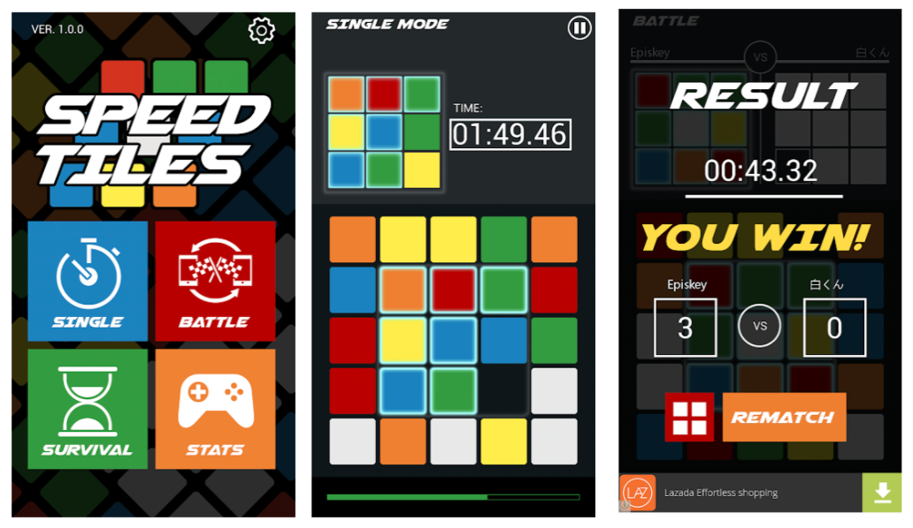

# :video_game: SLATE! Sliders

###Authors: Justin Hylton, Renae St Louis and Richard Lawrence

## Description
A sliding pattern matching game coded in Ruby.  Using the Ruby 2d library.

## Screenshots

## Installation

**Before installing, make sure you have:**

* Ruby installed...
* Library dependencies...

**To install it, run**

* $ gem ****

## Starting the game

**Running in 800x600 window mode**

* $ ruby speed_tiles

##Controls

* Movement - Mouse clicks or arrow keys
* End - (q)