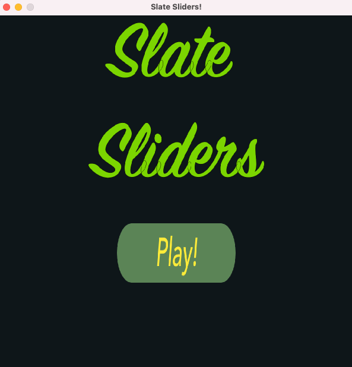
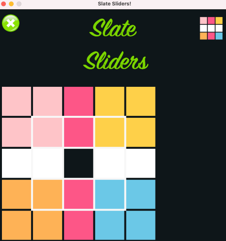

<!--

-->

# :video_game: SLATE! Sliders

### Authors: Justin Hylton, Renae St Louis and Richard Lawrence

## Description
A sliding pattern matching game coded in Ruby.  Using the Ruby 2d library.

## Screenshots

## Installation

**Before installing, make sure you have:**

* Ruby installed.
* Library dependencies: Ruby 2D

**To install it, run**

* $ bundle install

## Starting the game

**Running in 600x600 window mode**

* $ ruby lib/slate_sliders/run.rb

## Controls

* The `arrows keys` move your slate.
* Click the `close button` to quit the game.